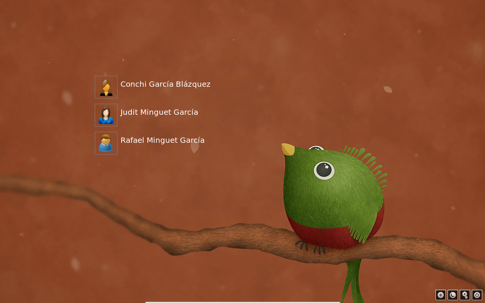
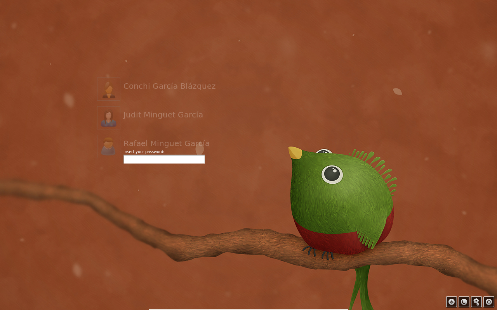

# Little Quetzal (a lightdm-webkit-greeter greeter)

Little Quetzal es una modificación de la pantalla de login (greeter) para sistemas GNU/Linux que tengan instalado lightdm-webkit-greeter.

El resultado sería:






Para poder ejecutarlo:
  1. Instalar lightdm-webkit-greeter
  2. Editar (o crear si no existe) el archivo `/etc/lightdm/lightdm.conf` y añadir la siguiente configuración:
  
    ```
    [SeatDefaults]
    greeter-session=lightdm-webkit-greeter
    user-session=<escritorio>
    ```
    Siendo `<escritorio>` el entorno con el que arrancará la sesión del usuario (yo por ejemplo tengo puesto "openbox").

    Si la opción del entorno se quiere establecer a nivel de usuario, se puede configurar en el archivo `/var/lib/AccountsService/users/<username>` asignando un valor a la clave `Xsession` (evidentemente, AccountsService debe estar instalado). Esta es mi configuración:

    ```
    ##/var/lib/AccountsService/users/rafael
    [User]
    Language=ca_ES@valencia
    FormatsLocale=ca_ES.UTF-8
    XSession=openbox
    SystemAccount=false
    Icon=/var/lib/AccountsService/icons/rafael
    ```

  3. Editar el archivo `/etc/lightdm/lightdm-webkit-greeter.conf` y modificar la línea: `webkit-theme=little_quetzal`.
  4. Descargar Little_Quetzal, descomprimirlo y con permisos de administrador copiarlo en `/usr/share/lightdm-webkit/themes/`.


La imagen de fondo pertenece a Vlad Gerasimov y se puede encontrar en su [página web](http://www.vladstudio.com/) o en su [página de deviantart](http://vladstudio.deviantart.com/). Por último, los iconos de las acciones pertenecen a Jean-Francois Brazeau y se encuentran [aquí](https://github.com/jfbrazeau/lightdm-webkit-pretty-greeter/tree/master/img).